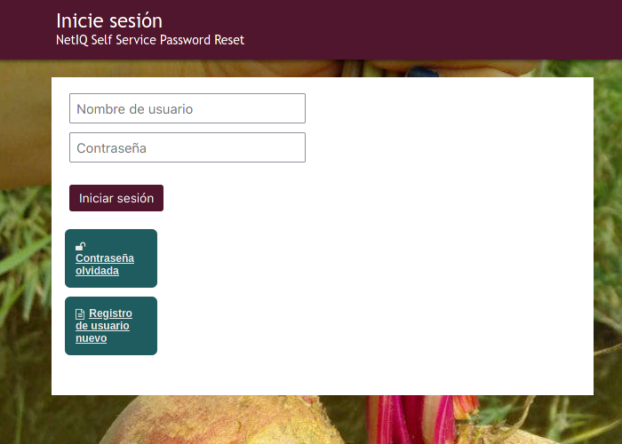
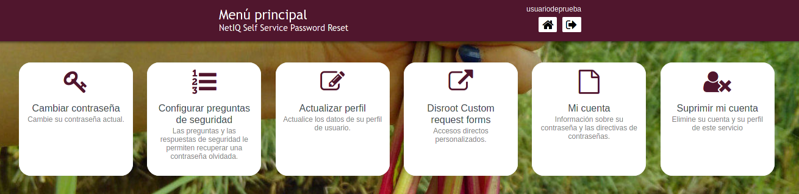

# Centro de Auto-gestión de Usuarixs

El **Centro de Auto-gestión de Usuarixs** es el lugar desde el que puedes administrar y configurar tu cuenta de **Disroot**. Las opciones van desde cambiar la contraseña hasta borrar la cuenta misma.

## Iniciar sesión
Ve a [https://user.disroot.org](https://user.disroot.org) y accede con tu nombre de usuarix y contraseña de **Disroot**.

## El panel
Una vez que hayas iniciado sesión verás el **panel** o **tablero**.

Es un menú de accesos rápidos a las configuraciones y opciones de la cuenta.

- [Cambiar tu contraseña](../password)
- [Configurar las preguntas de seguridad](../questions)
- [Actualizar tu perfil](../profile)
- [Formularios de solicitudes](../forms)
- [Información de la cuenta](../info)
- [Borrar tu cuenta](../delete)

Desde del **Centro de Auto-gestión** también puedes:

- [Restablecer tu contraseña](pwd_reset)
- [Registrar una nueva cuenta](new_reg)
