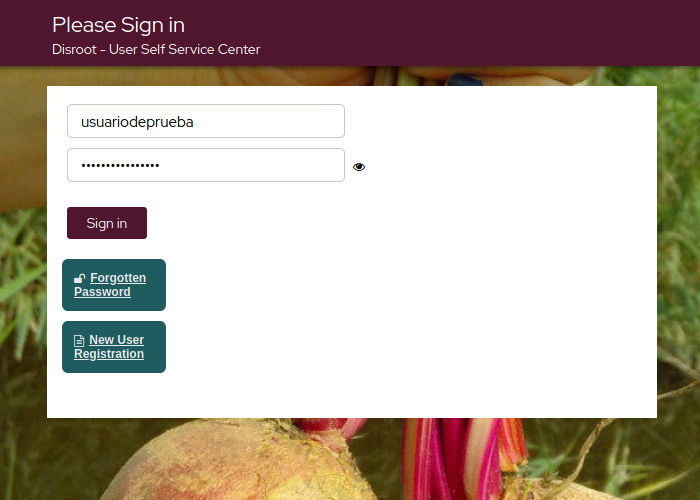

# User Self Service Center
L'**User Self Service Center** è il luogo in cui è possibile gestire le impostazioni dell'account **Disroot**, dalla modifica della password all'eliminazione. 

## Accedi
Vai su [https://user.disroot.org](https://user.disroot.org) e accedi con le tue credenziali di **Disroot**.

## La dashboard
Una volta fatto l'accesso ti troverai nella **dashboard**.

È un menu di accesso rapido alle impostazioni e alle opzioni dell'account. 
- [Cambia la password](../password)
- [Configura la tua domanda di sicurezza](../questions)
- [Aggiorna il tuo profilo](../profile)
- [Moduli di richiesta](../forms)
- [Infomrazioni sull'account](../info)
- [Elimina l'account](../delete)

Dalla pagina dello **User Self Service Center** puoi inoltre:

- [Modificare la password](pwd_reset)
- [Registrare un nuovo account](new_reg)
