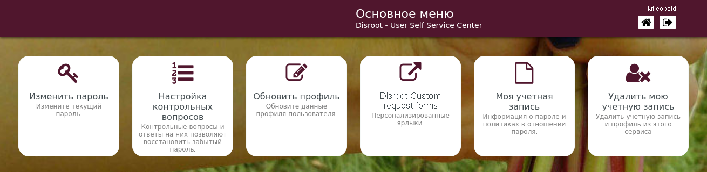

# Пользовательский центр самообслуживания

**Пользовательский центр самообслуживания** — это место, где вы можете управлять настройками своей учётной записи **Disroot**, от изменения пароля до удаление учётной записи. 

## Вход в систему
Перейдите на [https://user.disroot.org](https://user.disroot.org) и войдите в систему, используя свое имя пользователя и пароль **Disroot**.

## Панель управления
После входа в систему вы увидите **панель управления**.

Это меню быстрого доступа к настройкам и параметрам учетной записи.

- [Изменить пароль](../password)
- [Настроить контрольные вопросы](../questions)
- [Обновить профиль](../profile)
- [Формы запросов](../forms)
- [Информация об учётной записи](../info)
- [Удалить учётную запись](../delete)

На странице **Центра самообслуживания пользователей** также можно:

- [Сбросить пароль](pwd_reset)
- [Зарегистрировать новый аккаунт](new_reg)
