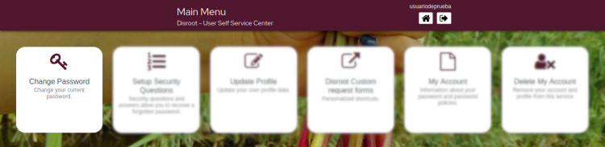
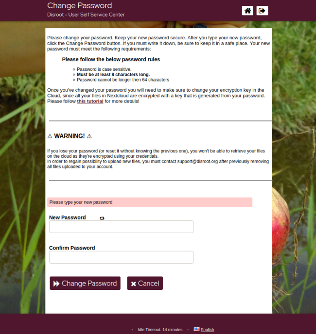

# Change your password

Click on this option to change your current password.

!!  
!! Please read carefully the instructions and rules for changing the password and the additional steps needed to update your **Cloud** encryption key.

!!  
!! Please also note that once you've changed your password you will need to make sure to change your encryption key in the **Cloud**, since all your files in **Nextcloud** are encrypted with a key that is generated from your password.
