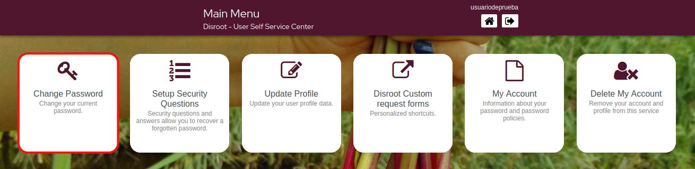
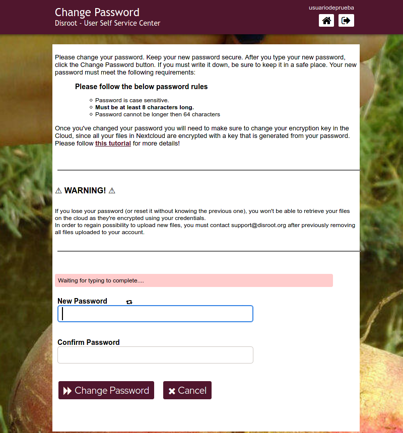
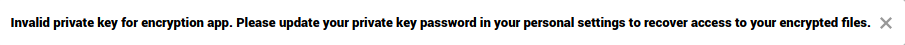
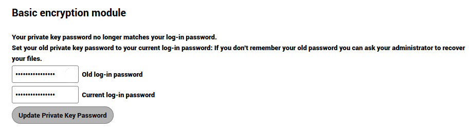
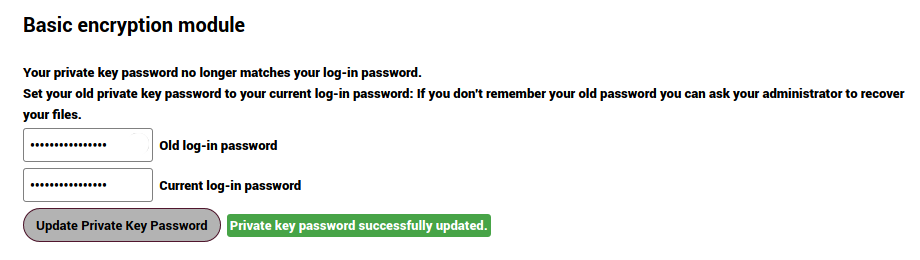

# Change your password

#### clic on this option to change your current password.

!! #### NOTICE 
!! **Please read carefully the instructions and rules for changing the password and the additional steps needed to update your Cloud encryption key.**

!! **Once you've changed your password you will also need to make sure to change your encryption key in the Nextcloud, since all your files in the Cloud are encrypted with a key that is generated from your password.**

----

# Updating your encryption keys in the Cloud

1. Go to [https://cloud.disroot.org](https://cloud.disroot.org) and log in with your username and new password.

  You will see this message at the top of the page:

  

2. Go to the menu at the top right and select **Settings**

3. From the left panel select **Security** and then on the right panel scroll down to **Basic encryption module**

  

4. Enter your old password then the new one and finally clic on the **Update Private Key Password** button

  

5. Log out of the **Cloud**, log back in and that's it. Now your all your data in the **Cloud** is encrypted with your new encryption keys.

!! #### NOTICE 
!! **Remember that if you lose your password, you will not be able to access your files in the cloud as they are encrypted, so even the server administrators cannot see their content.**
