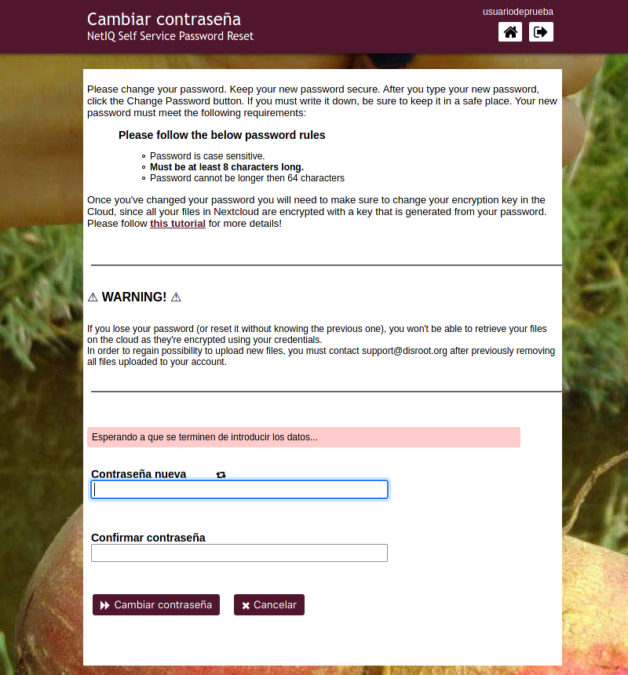
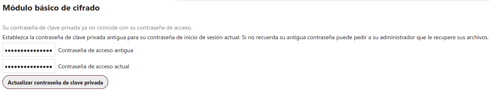
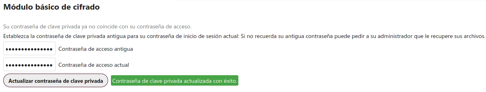

# Cambiar contraseña

#### Selecciona esta opción para cambiar tu contraseña actual.

!! #### IMPORTANTE 
!! **Luego de cambiar tu contraseña asegúrate de actualizar tu clave de cifrado en Nextcloud también, ya que todos tus archivos en la Nube están cifrados con una clave generada a partir de la contraseña de tu cuenta.**

**Por favor, lee cuidadosamente las instrucciones y reglas para cambiar la contraseña y los pasos adicionales necesarios para actualizar la clave de cifrado de tu Nube.**

!! **La contraseña debe cumplir los siguientes requisitos:**
!! - La contraseña distingue entre mayúsculas y minúsculas.
!! - Debe tener al menos 8 caracteres.
!! - La contraseña no puede tener más de 64 caracteres

----

# Actualizando tu clave de cifrado en la Nube

1. Ve a [https://cloud.disroot.org](https://cloud.disroot.org) e inicia sesión con tu usuarix y la nueva contraseña.

  Verás este mensaje en la parte superior de la página:

  

2. Ve al menú que está en la esquina superior derecha y selecciona **Configuración**

  

3. En el panel de la izquierda, selecciona **Seguridad** y luego, en la ventana central a la derecha, desplázate hacia abajo hasta **Módulo básico de cifrado**.

  

4. Ingresa la contraseña anterior, luego la nueva y finalmente haz clic en el botón **Actualizar contraseña de clave privada**

  

5. Una vez modificada la contraseña, cierra la sesión y vuelve a iniciarla. Ahora toda tu información en la **Nube** está cifrada con tus nuevas claves.

!! #### IMPORTANTE 
!! **Recuerda que si pierdes/olvidas tu contraseña, no podrás acceder de nuevo a tus archivos en la nube ya que están cifrados con claves generadas a partir de ella.**
