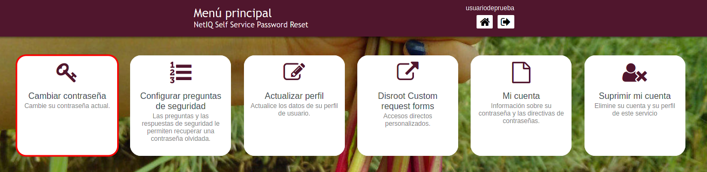
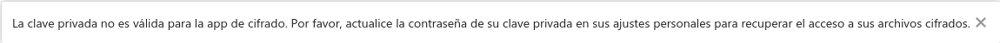

# Cambiar contraseña

#### Selecciona esta opción para cambiar tu contraseña actual.

!! #### AVISO 
!! **Por favor, lee cuidadosamente las instrucciones y reglas para cambiar la contraseña y los pasos adicionales necesarios para actualizar la clave de cifrado de tu Nube.**

!! **Luego de cambiar tu contraseña asegúrate de modificar tu clave de cifrado en Nextcloud también, ya que todos tus archivos en la Nube están cifrados con una clave que se genera a partir de la contraseña.**

----

# Actualizando tu clave de cifrado en la Nube

1. Ve a [https://cloud.disroot.org](https://cloud.disroot.org) e inicia sesión con tu usuarix y la nueva contraseña.

  Verás este mensaje en la parte superior de la página:

  

2. Ve al menú que está en la esquina superior derecha y selecciona **Configuración**

  

3. En el panel de la izquierda, selecciona **Seguridad** y luego, en la ventana central a la derecha, desplázate hacia abajo hasta **Módulo básico de cifrado**.

  

4. Ingresa la contraseña anterior, luego la nueva y finalmente haz click en el botón **Actualizar contraseña de clave privada**

  

5. Cierra la sesión, vuelve a iniciarla y listo. Ahora toda tu información en la **Nube** está cifrada con tus nuevas claves de cifrado.

!! #### AVISO 
!! **Recuerda que si pierdes tu contraseña, no podrás acceder a tus archivos en la nube ya que están cifrados y ni siquiera lxs administradores pueden ver su contenido.**
