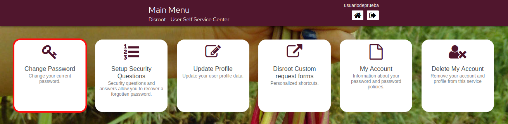
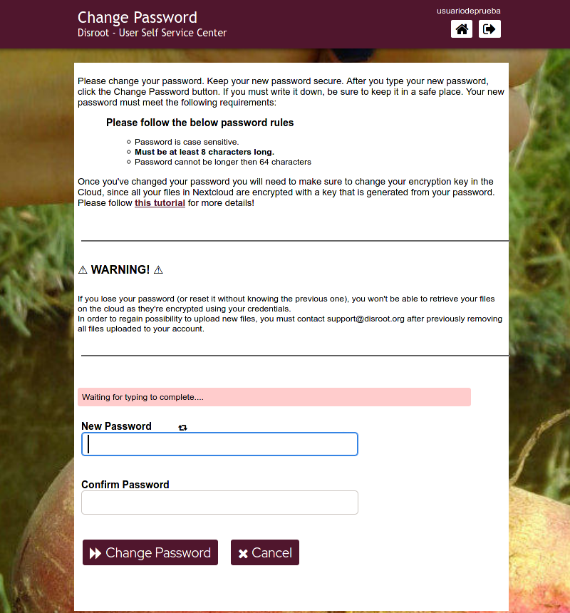
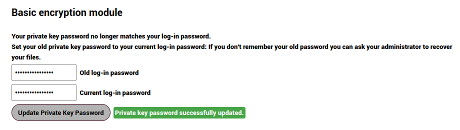

# Cambiare la password

#### Clicca su questa opzione per cambiare la tua password

!! #### ATTENZIONE 
!! **Si prega di leggere attentamente le istruzioni e le regole per modificare la password e i passaggi aggiuntivi necessari per aggiornare la chiave di crittografia del Cloud.**

!! **Dopo aver cambiato la tua password dovrai anche assicurarti di cambiare la tua chiave di crittografia nel Nextcloud, poiché tutti i tuoi file nel Cloud sono crittografati con una chiave che viene generata dalla tua password.**

----

# Aggiornare le tue chiavi di crittografia nel Cloud 

1. Vai su [https://cloud.disroot.org](https://cloud.disroot.org) e accedi con il tuo nome utente e la nuova password. 

Vedrai questo messaggio nella parte superiore della pagina: 

  

2. Vai nel menu in alto a destra e seleziona **Impostazioni** 

3. Dal pannello di sinistra seleziona **Sicurezza** e poi nel pannello di destra scorri verso il basso fino a **Modulo di crittografia di base** 

  

4. Inserisci la tua vecchia password, poi quella nuova e infine fai clic sul pulsante **Aggiorna password chiave privata** 

  

5. Esci dal **Cloud**, accedi di nuovo e il gioco è fatto. Ora tutti i tuoi dati nel **Cloud** sono crittografati con le tue nuove chiavi di crittografia. 

!! #### ATTENZIONE 
!! **Ricorda che se perdi la password, non sarai in grado di accedere ai tuoi file nel cloud poiché sono crittografati, quindi anche gli amministratori del server non possono vederne il contenuto.**
