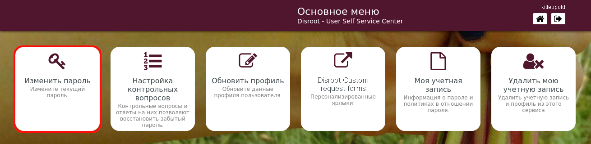
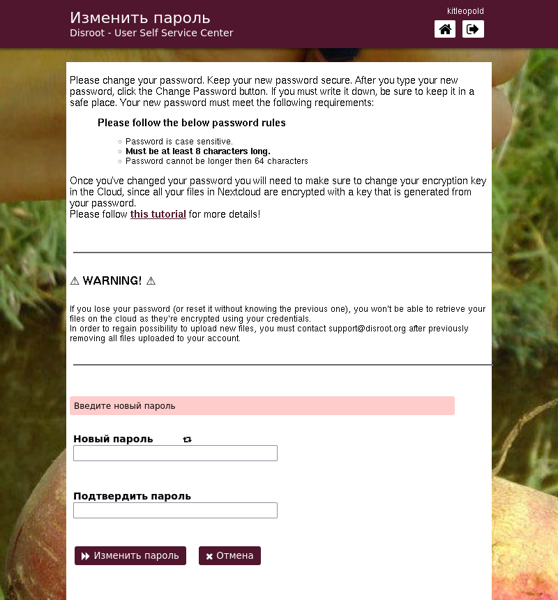
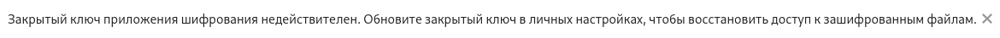
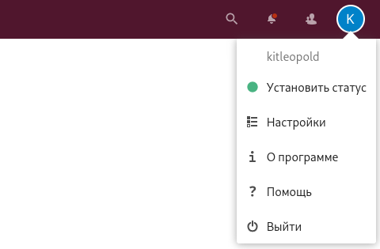
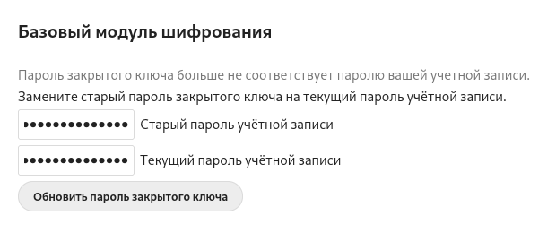
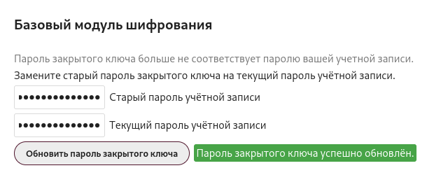

# Изменить пароль

#### Выберите эту опцию, чтобы изменить текущий пароль.

!! #### ВНИМАНИЕ 
!! **После смены пароля обязательно обновите ключ шифрования Nextcloud, так как все ваши файлы в облаке зашифрованы с помощью ключа, сгенерированного из пароля вашей учетной записи.**

**Пожалуйста, внимательно прочитайте инструкции и правила по изменению пароля и дополнительные шаги, необходимые для обновления ключа шифрования вашего облака.**

!! **Пароль должен соответствовать следующим требованиям:**
!! - Пароль чувствителен к регистру.
!! - Должно быть не менее 8 символов.
!! - Пароль не может быть длиннее 64 символов

----

# Обновление ключей шифрования в облаке

1. Перейдите на [https://cloud.disroot.org](https://cloud.disroot.org) и войдите под своим именем пользователя и новым паролем.

  Вы увидите это сообщение в верхней части страницы:

  

2. Перейдите в меню в правом верхнем углу и выберите **Настройки**.

  

3. На левой панели выберите **Безопасность**, a затем прокрутите страницу вниз до **Базовый модуль шифрования**.

  

4. Введите старый пароль, затем новый пароль и нажмите кнопку **Обновить пароль закрытого ключа**.

  

5. После изменения пароля выйдите из системы и войдите снова. Теперь вся ваша информация в **Облаке** зашифрована вашими новыми ключами.

!! #### ВНИМАНИЕ 
!! **Помните, что если вы потеряете или забудете свой пароль, вы не сможете получить доступ к своим файлам в облаке, поскольку они зашифрованы сгенерированными на основе него ключами.**