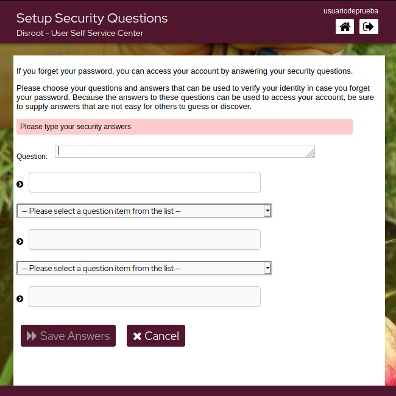

# Setup your Security Questions

In case you forget/lose your password, you can reset it without Admins intervention by setting the security questions first. To do it, click on this option.

The proccess is pretty simple.

- Click on ***Setup Security Questions***.

 

- Write the first question and its answer, then select the next two questions from the drop-down list and write the answers as well.

  

- Once the answers meet the requirements, just click **Save Answers** and finally **Continue**

  
