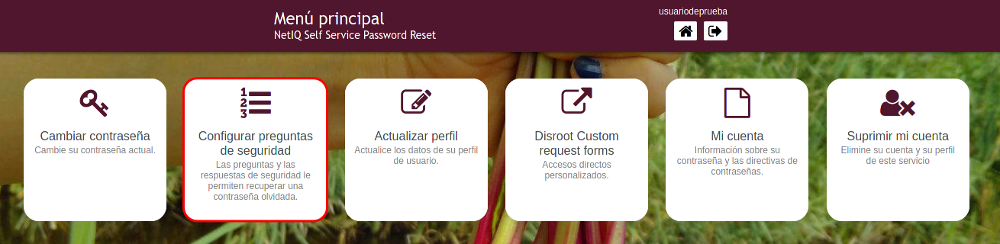
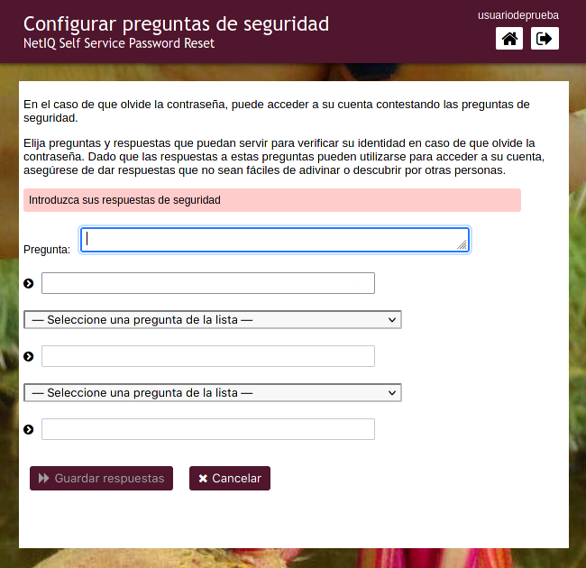
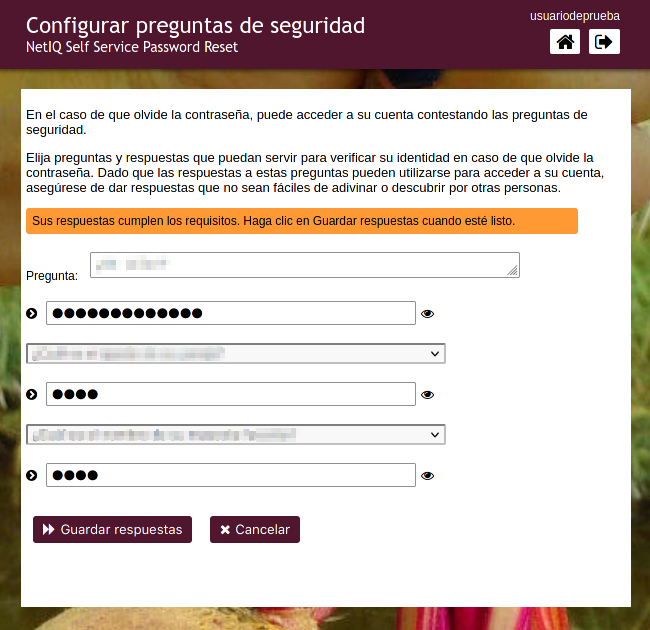
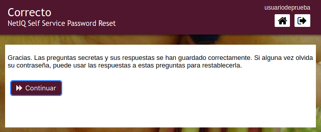

# Configurar las preguntas de seguridad

En caso que olvides/pierdas tu contraseña, puedes restablecerla sin intervención de lxs administradores configurando primero las preguntas de seguridad. Para hacerlo, haz click en esta opción.

El proceso es bastante sencillo.

- Selecciona ***Configurar preguntas de seguridad***.

 

- Escribe la primera pregunta y su respuesta. Luego selecciona las siguientes dos preguntas a partir de las opciones de la lista desplegable y escribe también las respuestas.

  

- Una vez que las respuestas cumplan con los requisitos, solo haz click en **Guardar respuestas** y finalmente en **Continuar**

  
