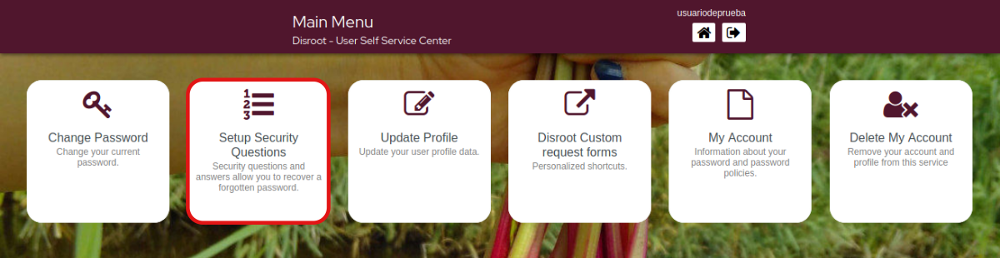
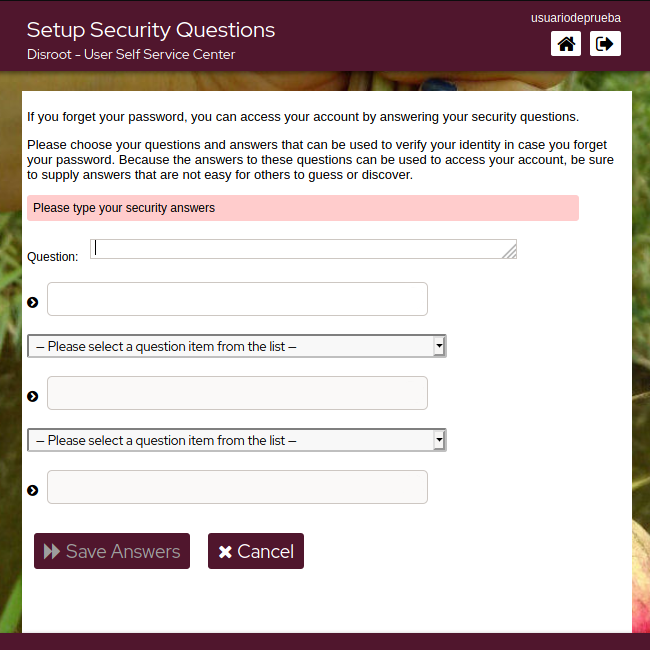
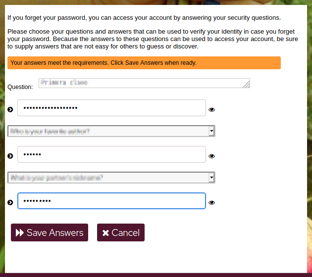
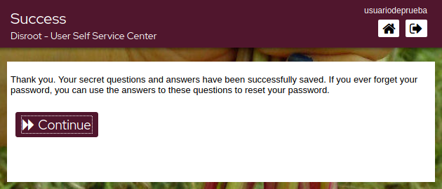

# Configurez vos questions de sécurité

En cas d'oubli/de perte de votre mot de passe, vous pouvez le réinitialiser sans l'intervention des administrateurs en configurant d'abord les questions de sécurité. Pour ce faire, cliquez sur cette option.

Le processus est assez simple.

- Cliquez sur ***Setup Security Questions***.

 

- Rédigez la première question et sa réponse, puis sélectionnez les deux questions suivantes dans la liste déroulante et rédigez également les réponses.

  

- Une fois que les réponses répondent aux exigences, cliquez simplement sur **Sauvegarder les réponses** et enfin **Continuer**.

  
