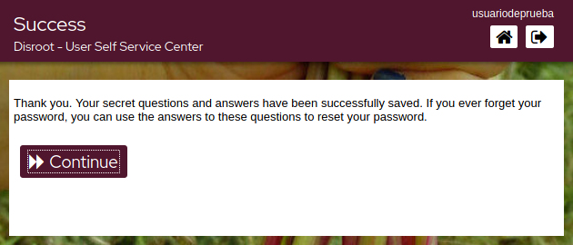

# Imposta le tue domande di sicurezza 

Nel caso in cui dimentichi/perdi la password, puoi reimpostarla senza l'intervento dell'amministratore impostando prima le domande di sicurezza. Per farlo, clicca su questa opzione.

Il processo è piuttosto semplice. 

- Clicca su ***Imposta le domande di sicurezza***.

 

- Scrivi la prima domanda e la relativa risposta, quindi seleziona le due domande successive dall'elenco a discesa e scrivi anche le risposte.

  

- Una volta che le risposte soddisfano i requisiti, fai clic su **Salva risposte** e infine su **Continua** 

  
