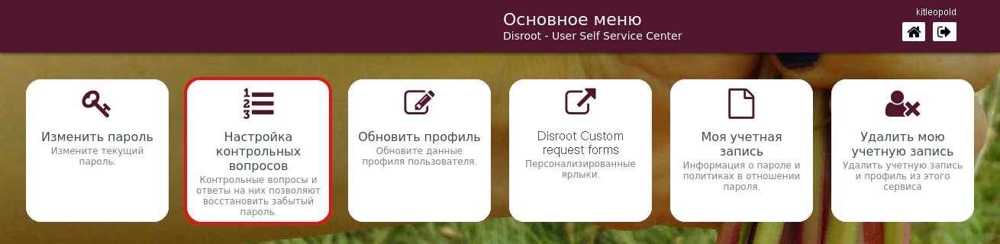
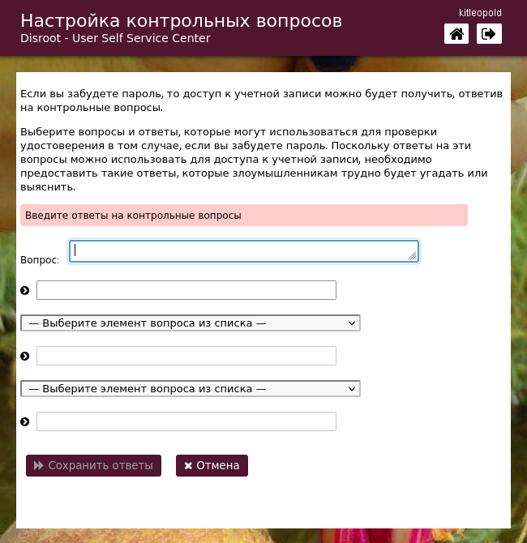
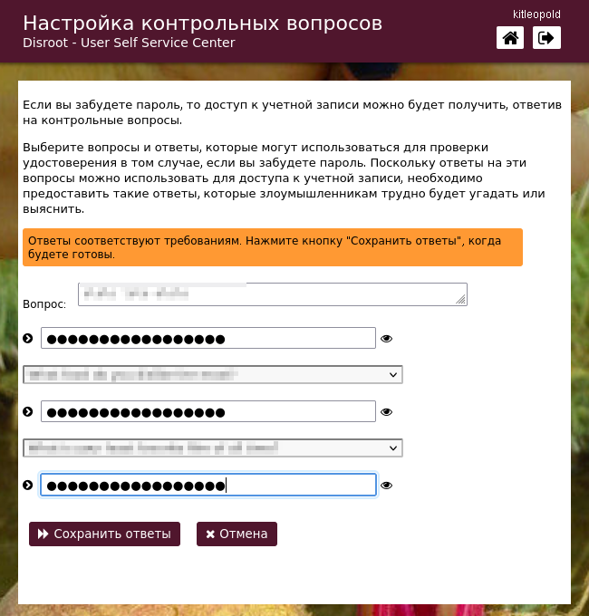
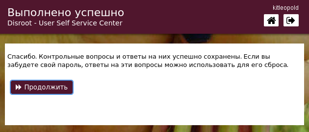

# Настройка контрольных вопросов

Если вы забыли/потеряли свой пароль, вы можете сбросить его без вмешательства администратора, предварительно создав контрольные вопросы. Для этого нажмите на эту опцию. 

Этот процесс довольно простой.

- Выберите ***Настройка контрольных вопросов***.

 

- Напишите первый вопрос и ответ на него, затем выберите следующие два вопроса из выпадающего списка и также напишите ответы.

 

- Как только ответы будут соответствовать требованиям, просто нажмите **Сохранить ответы** и **Продолжить**.

 
