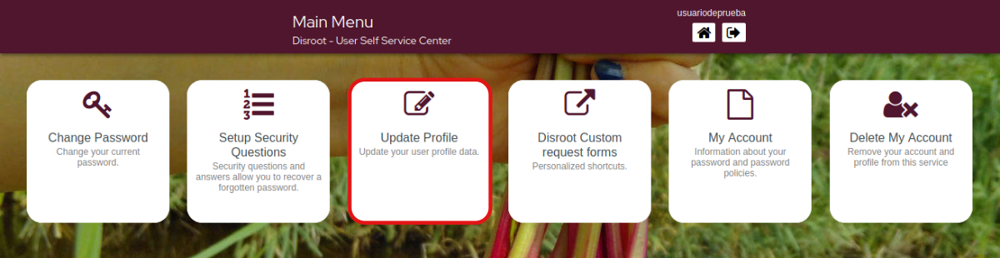
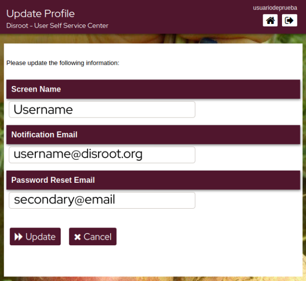

# Update your Profile
Whether it's to receive notifications or reset your password, you can add a secondary email address to your profile. You can also modify your screen name (the name that will appear on the services screens).

Complete/update the information.

- **Screen Name**: this is the name you choose to identify yourself through different services that requires **Disroot** credentials.
- **Notification Email**: the email address where you will receive important information related to your account. From time to time, you may also receive information about us, such as services or improvements announcements or the **Disroot** annual report.
- **Password Reset Email**: you can add/modify a secondary email address so that you can use it to reset your password in case you lose/forget it.
