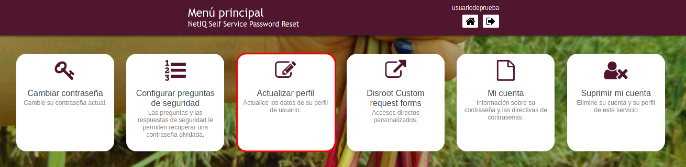
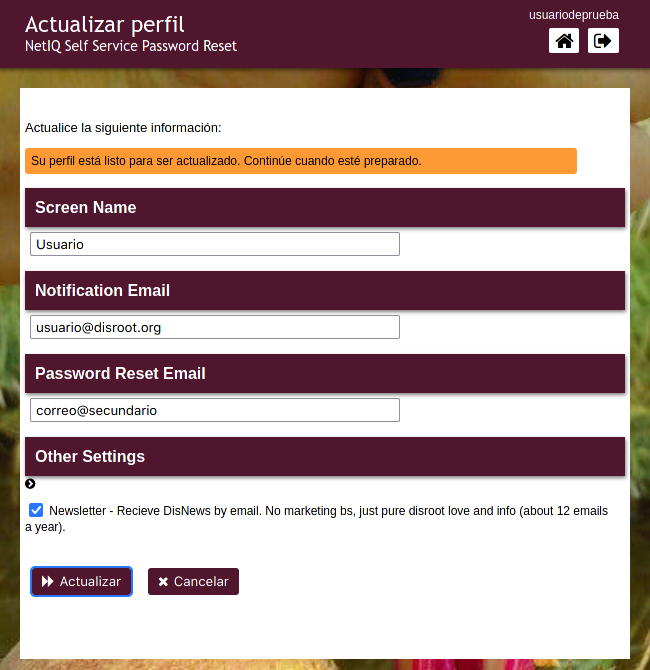
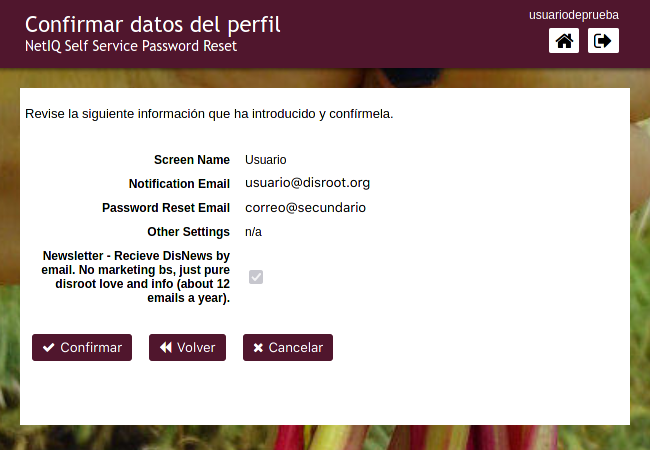
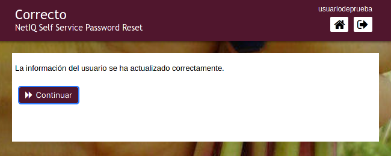

# Actualizar perfil
Ya sea para recibir notificaciones o restablecer tu contraseña, puedes agregar una dirección de correo secundaria a tu perfil. También puedes modificar tu nombre en pantalla (el nombre que aparecerá en la pantalla de los servicios).

Completa/actualiza la información.

- **Screen Name (Nombre en pantalla)**: este es el nombre con el que eliges identificarte a través de los diferentes servicios que requieren ingresar las credenciales de **Disroot**.
- **Notification Email (Correo de notificación)**: la dirección de correo electrónico en la que recibirás información importante relativa a tu cuenta. De vez en cuando, podrías recibir también algún mensaje nuestro comunicando alguna novedad importante sobre los servicios o el reporte anual de **Disroot**.
- **Password Reset Email (Correo para restablecimiento de contraseña)**: aquí puedes agregar/modificar una dirección de correo electrónico para que, en el caso que pierdas/olvides tu contraseña, puedas utilizarla para recuperar el acceso a tu cuenta.
- **Other Settings (Otras configuraciones)**: selecciona/deselecciona la opción de recibir DisNews, un breve resumen sobre lo que va aconteciendo en **Disroot** (unos 12 correos al año).

Cuando estés conforme, haz click en **Actualizar**. Aparecerá la pantalla de confirmación donde puedes verificar una vez más que la información esté correcta. Si es así, presiona el botón **Confirmar**...

y finalmente, **Continuar**.

