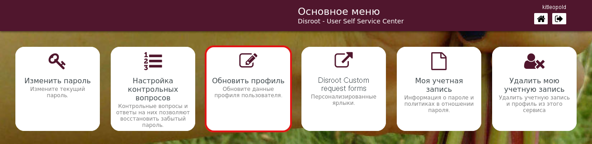
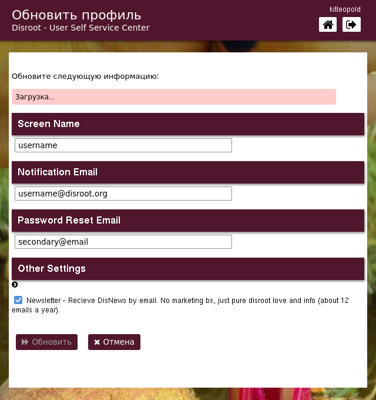

# Обновить профиль
Независимо от того, хотите ли вы получать уведомления или сбросить пароль, вы можете добавить в свой профиль дополнительный адрес электронной почты. Вы также можете изменить своё отображаемое имя (имя, которое будет отображаться на экранах служб).

Дополнить/обновить информацию.

- **Screen Name**: это имя, которое вы выбираете, чтобы идентифицировать себя через различные службы, требующие учетных данных **Disroot**.
- **Notification Email**: адрес электронной почты, на который вы будете получать важную информацию, связанную с вашей учетной записью. Время от времени вы также можете получать информацию о нас, например объявления об услугах или улучшениях или годовой отчет **Disroot**.
- **Password Reset Email**: вы можете добавить/изменить дополнительный адрес электронной почты, чтобы использовать его для сброса пароля в случае, если вы его потеряете или забудете.
