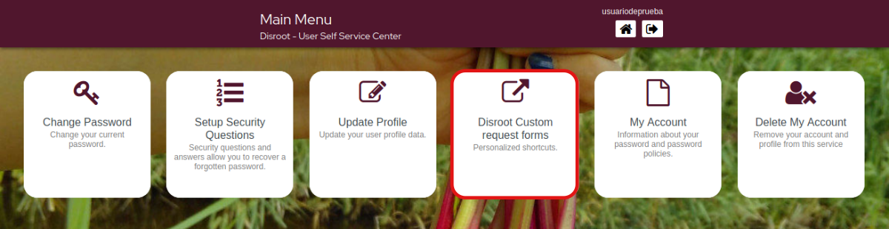
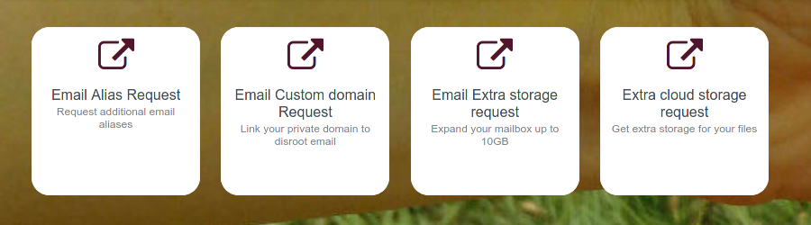

# Custom Requests forms

From here you can access the forms to request:
- Additional email alias
- Link your personal domain
- Request extra storage for your mailbox, or...
- Request extra storage for your **Cloud**.

Just clic on the option you need and the form will open for you to complete.

