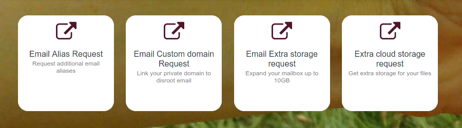

# Formulaires de demandes personnalisées

D'ici vous pouvez accéder aux formulaires de demande :
- Un alias de courriel supplémentaire
- Lier votre domaine personnel
- Demander un stockage supplémentaire pour votre boîte aux lettres, ou...
- Demander un espace de stockage supplémentaire pour votre **Cloud**.

Cliquez simplement sur l'option dont vous avez besoin et le formulaire s'ouvrira pour que vous puissiez le remplir.

