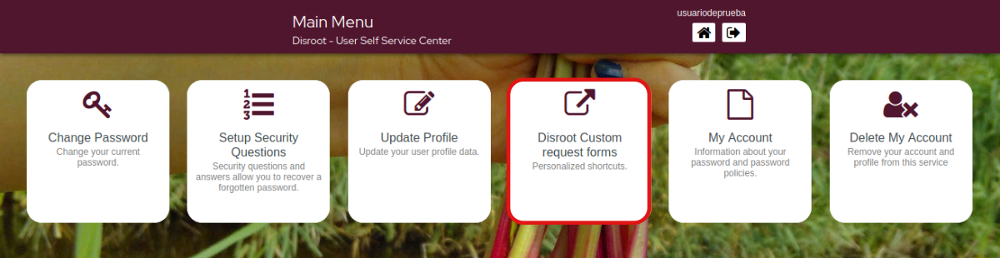

# Moduli per richieste personalizzate

Da qui puoi accedere ai moduli per richiedere:
- Alias di posta elettronica aggiuntivo
- Collega il tuo dominio personale
- Richiedi spazio di archiviazione aggiuntivo per la tua casella di posta
- Richiedi spazio di archiviazione aggiuntivo per il tuo **Cloud**. 

Basta fare clic sull'opzione che ti serve e si aprirà il modulo da completare. 

