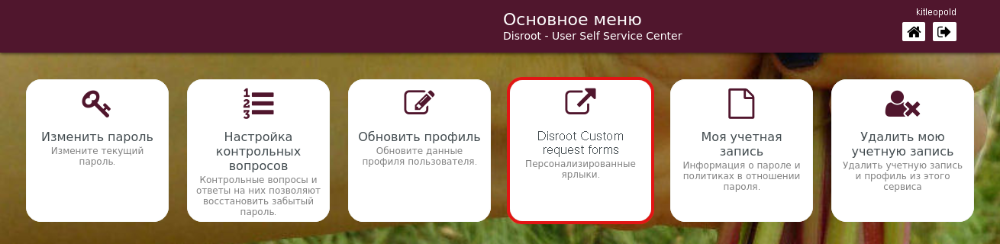

# Пользовательские формы запросов

Отсюда вы можете получить доступ к формам для запроса:
- Дополнительные псевдонимы электронной почты
- Привяжите свой личный домен (запрос личного домена электронной почты)
- Дополнительное место для вашего почтового ящика (Запрос дополнительного места для электронной почты) или...
- для вашего **Облака** (Запрос на дополнительное место для облачного хранилища).

Просто нажмите на нужный вариант, и откроется форма для заполнения.

