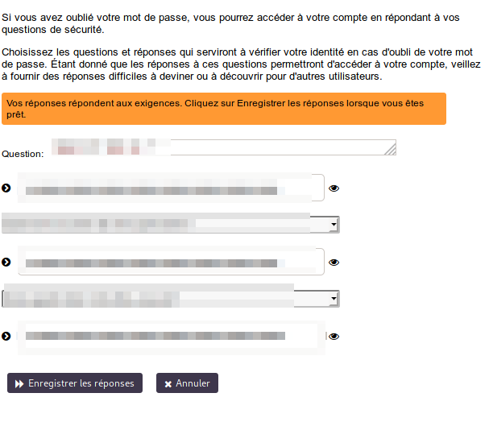

# Self Service Utilisateurs (USSC : User Self Service Center)

Le **Self-Service Utilisateurs** est l'endroit où vous pouvez gérer les paramètres de votre compte **Disroot** :

[Connectez-vous](https://user.disroot.org/) avec vos identifiants **Disroot** (nom d'utilisateur et mot de passe).

## Changer votre mot de passe
 
Choisissez cette option pour changer votre mot de passe actuel.

Suivez la procédure pour la création d'un mot de passe et entrez le nouveau deux fois.

 

Une fois votre mot de passe changé, vous devrez impérativement changer votre clé de chiffrement dans le **Cloud**, vu que tous vos fichiers sur **Nextcloud** sont chiffrés (cryptés) avec une clé générée à partir de votre mot de passe.

1. Rendez vous sur **[https://cloud.disroot.org](https://cloud.disroot.org)** et connectez-vous avec votre nouveau mot de passe.  
Vous allez voir un message en haut de la page :  

 
    `Clé privée invalide pour l'application de chiffrement. S'il vous plaît mettez à jour le mot de passe de votre clé privée dans vos paramètres personnels afin de récupérer l'accès à vos fichiers chiffrés.`

2. Dans le coin supérieur droit, cliquez sur la lettre majuscule représentant votre nom utilisateur, puis choisissez le menu **Paramètres**.

3. Cliquez sur  **Sécurité**, dans le menu présenté dans la partie gauche de la fenêtre.

4. Faites défiler vers le bas jusqu'au **Module de chiffrement basique** ; écrivez votre ancien mot de passe, puis votre nouveau mot de passe et cliquez sur **Mettre à Jour la clé privée**.

5. Déconnectez-vous de **Nextcloud** et re-connectez-vous.  
Voilà, tout est en ordre et vous pouvez voir à nouveau vos fichiers.

!! **ATTENTION:** 
!! **Si vous perdez votre mot de passe, vous ne serez pas en mesure de récupérer vos fichiers dans le cloud puisque ceux-ci sont chiffrés. Ainsi, même les administrateurs du serveur ne peuvent voir leur contenu.**

## Configurer les Questions de Sécurité
 
Dans le cas où vous oubliez/perdez votre mot de passe, vous avez la possibilité de le réinitialiser sans l'intervention des admins, en configurant d'abord des questions de sécurité.

La procédure est assez simple : cliquez sur ***Configurer des Questions de Sécurité***.

 
Rédigez la première question ainsi que sa réponse, ensuite sélectionnez les deux suivantes de la liste déroulante et rédigez les réponses également.

 
Dès que les réponses correspondront aux critères, cliquez simplement sur ***Enregistrez les Réponses***.

## Mettre à Jour le Profil
 
Que ce soit pour recevoir des notifications ou pour réinitialiser le mot de passe, vous pouvez ajouter une seconde adresse email à votre profil. Vous pouvez aussi modifier votre nom d'écran *(le nom qui apparaîtra sur les différentes pages de service.)*

## Informations du Compte
 
Vous trouverez ici un résumé des **informations du compte et du mot de passe**, **la stratégie du mot de passe** *(les règles que doit suivre un mot de passe pour être valide)* ainsi que **l'historique** de la gestion des mots de passe.

## Suppression du Compte
 
Si, pour quelque raison que ce soit, vous désirez supprimer votre compte, il vous suffit de cliquer sur cette option. Si vous êtes absolument certain de ce choix, cochez la case **J'accepte** et enfin **Supprimer**.

!! **ATTENTION:** 
!! **Cette démarche est irréversible.**  Une fois confirmée, **vous ne serez pas en mesure de vous connecter** à votre compte ni ensuite de demander de le **restaurer**. **Toutes vos données seront supprimées** dans les 48 heures ; **votre nom d'utilisateur actuel ne sera plus disponible** si vous voulez créer un nouveau compte.
