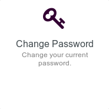
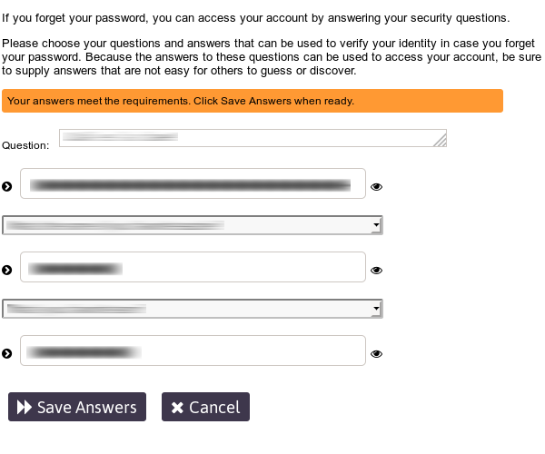
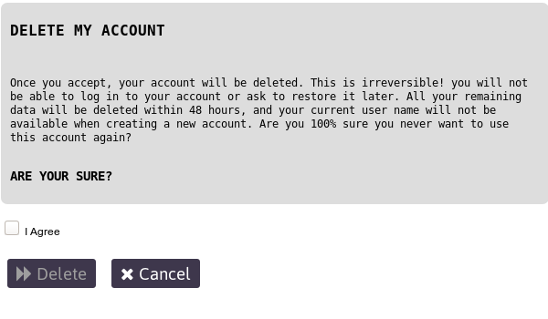

# Benutzer-Selbstverwaltung

Das **User Self Service Center** ist Deine Zentrale zur Verwaltung der Einstellungen Deines **Disroot** Accounts.

Logge Dich mit Deinem **Disroot** Benutzernamen und Passwort ein.

## Passwort ändern
 
Wähle die Option **change password** aus, um Dein aktuelles Passwort zu ändern.

Befolge die Regeln zur Passworterstellung und gibt Dein neues Passwort zweimal ein. Je grüner der Balken neben Deinem neuen Passwort dabei wird, umso sicherer ist es. Bestätige die Änderung mit der Enter-Taste oder durch Klicke auf ***Change Password***

 
Wenn Du Dein Passwort geändert hast, solltest Du unbedingt noch Deinen Schlüssel zur Verschlüsselung in der **Cloud** ändern, da alle Deine Dateien in **Nextcloud** mit einem Schlüssel, der aus Deinem Passwort generiert wird, verschlüsselt sind. Nach der Passwortänderung passen also Schlüssel und Passwort nicht mehr zueinander.

1. Gehe zu **[https://cloud.disroot.org](https://cloud.disroot.org)** und melde Dich mit Deinem neuen Passwort an.
Du wirst eine gelbe Nachricht am oberen Rand der Seite sehen: 

 
    `Invalid private key for Encryption App. Please update your private key password in your personal settings to recover access to your encrypted files.`

2. Klicke auf Deinen Namen in der oberen rechten Ecke und wähle **Personal** aus dem Menü.

3. Scrolle nach unten zu **Basic Encryption Module**, gib Dein altes und Dein neues Passwort ein und klicke auf **Update Private Key Password**.

4. Melde Dich von **Nextcloud** ab und wieder an und das war's. Du hast alles erledigt und kannst wieder auf Deine Dateien zugreifen.

**WICHTIG**
Wenn Du Dein Passwort verlierst oder vergisst, hast Du **keine** Möglichkeit mehr, an Deine Dateien zu kommen, da diese verschlüsselt sind. Nicht mal die Server-Administratoren können den Inhalt Deiner Dateien sehen.  

## Sicherheitsfragen einrichten
 
Für den Fall, dass Du Dein Passwort verlierst oder vergisst, kannst Du es zurücksetzen, ohne dass ein Administrator eingreifen muss. Hierfür musst Du nur vorher die Sicherheitsfragen einrichten.

Der Ablauf ist ziemlich einfach: Klicke auf ***Setup Security Questions***.

 
Schreibe die erste Frage und ihre Antwort, dann wähle die nächsten zwei Fragen aus den Drop-Down-Menüs und schreibe Deine Antworten in die zugehörigen Textfelder. 

 
Sobald die Antworten den Anforderungen entsprechen, klicke einfach auf ***Save Answers***.

## Aktualisierung des Profils
 
Sowohl um Benachrichtigungen zu erhalten als auch um Dein Passwort zurückzusetzen, kannst über die Option **Update Profile** eine zweite Email-Adresse eingeben. Außerdem kannst Du Deinen Anzeigename ändern (der Name, der in der "Services"-Ansicht erscheint). Wenn Du mit Deinen Eingaben zufrieden bist, klicke einfach auf ***Update***

## Accountinformationen
 
Unter **My Account** findest Du eine Zusammenfassung der **Account- und Passwort-Informationen**, die **Passwort-Grundsätze** (die Anforderungen, die ein Passwort erfüllen muss) und den **Verlauf** der Passwort-Verwaltung.

## Account löschen
 
Wenn Du, aus welchen Gründen auch immer, Deinen Account löschen willst, klicke auf die Option **Delete My Account**. Wenn Du Dir wirklich sicher bist, dass Du Deinen Account löschen willst, setze den Haken bei **I Agree** und klicke schließlich ***Delete***.

**WICHTIG!!!**
**Dieser Vorgang ist unumkehrbar.** Einmal bestätigt, **kannst Du Dich nicht mehr in Deinem Account anmelden** oder später um eine **Wiederherstellung** bitten. **Alle Deine Daten** werden innerhalb von 48 Stunden **gelöscht** und **Dein aktueller Benutzername wird nicht zur Verfügung stehen**, wenn Du einen neuen Account erstellst.
