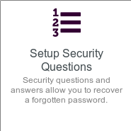
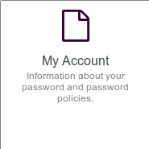

# User Self Service Center

The **User Self Service Center** is the place where you can manage your **Disroot** account settings, from changing the password to deleting it.

Go to [https://user.disroot.org](https://user.disroot.org) and log in with your **Disroot** username and password.

Once you have logged in you will see the **dashboard**.

It is a quick access menu to the account settings and options.

## 1. Change your password
Click on this option to change your current password.

!! Please read carefully the instructions and rules for changing the password and the additional steps needed to update your **Cloud** encryption key.

!! Please also note that once you've changed your password you will need to make sure to change your encryption key in the **Cloud**, since all your files in **Nextcloud** are encrypted with a key that is generated from your password.

## 02. Setup your Security Questions
In case you forget/lose your password, you can reset it without Admins intervention by setting the security questions first. To do it, click on this option.

The proccess is pretty simple.

- Click on ***Setup Security Questions***.

 

- Write the first question and its answer, then select the next two questions from the drop-down list and write the answers as well.

  

- Once the answers meet the requirements, just click ***Save Answers***.

  

## 03. Update your Profile
Whether it's to receive notifications or reset your password, you can add a secondary address to your profile. You can also modify your screen name (the name that will appear on the services screens).

Complete/update the information.

- **Screen Name**: this is the name you choose to identify yourself through different services that requieres **Disroot** credentials.
- **Notification Email**: the email address where you will receive important information related to your account. From time to time, you may also receive informatio about us, such as services or improvements announcements or the **Disroot** annual report.
- **Password Reset Email**: you can add/modify a secondary email address so that you can use it to reset your password in case you lose/forget it.

 

## 04. Custom Requests forms
From here you can access the forms to request additional email alias, link your personal domain or extra storage for your mailbox or cloud.

Just click on the option you need.

## 05. Your Account information
Here you can find a summary of the **account and password information**, **the password policy** (the rules that a password must comply with) and the **history** of the password management.

## 06. Delete your account
If for any reason you want to delete your account, just click this option.

Once you're sure about deleting the account, check the **I Agree** box and finally **Delete**.

!! **NOTE:** 
!! **This process is irreversible.** Once confirmed, **you won't be able to log in** to your account or ask **to restore it** later. **All your remaining data will be deleted** within 48 hours, and **your current user name will not be available** when creating a new account.
