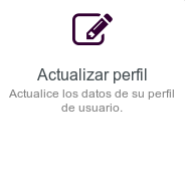

# Centro de Autoservicio de Usuario

El **Centro de Autoservicio de Usuario** es el lugar donde puedes gestionar las configuraciones de tu cuenta de **Disroot**.

Inicia sesión con tu nombre y contraseña de **Disroot**.

## Cambiar tu contraseña
 
Haz click en esta opción para cambiar tu actual contraseña.

Sigue las reglas de creación de contraseña e ingresa la nueva dos veces.

 

Una vez que hayas cambiado tu contraseña necesitarás asegurarte de cambiar tu clave de cifrado en la **Nube**, ya que todos tus archivos en **Nextcloud** están cifrados con una clave que se genera a partir de tu contraseña.

1. Ve a **[https://cloud.disroot.org](https://cloud.disroot.org)** e inicia sesión con tu nueva contraseña. 
Verás un mensaje en la parte superior de la página: 

  
`La clave privada no es válida para la app de cifrado. Por favor, actualice la contraseña de su clave privada en sus ajustes personales para recuperar el acceso a sus archivos cifrados.`

2. Haz click en tu nombre en la esquina superior derecha y selecciona **Personal** desde el menú.

3. Desplázate hasta el **Módulo básico de cifrado** y escribe tu antigua contraseña y la nueva y haz click en **Actualizar contraseña de clave privada**.

4. Cierra sesión en **Nextcloud**, vuelve a iniciarla y eso es todo, lo has configurado y puedes ver tus archivos de nuevo.

!!   **AVISO** 

!! **Si pierdes tu contraseña, no podrás recuperar tus archivos en la nube ya que están cifrados, de manera que ni siquiera los administradores del servidor pueden ver su contenido.**

## Configurar las preguntas de seguridad
 

En caso que olvides/pierdas tu contraseña, puedes restablecerla sin la intervención de los Administradores configurando primero las preguntas de seguridad.

El proceso es bastante sencillo: haz click en ***Configurar preguntas de seguridad***.

 

Escribe la primera pregunta y su respuesta, luego selecciona las siguientes dos preguntas desde el menú desplegable y escribe también las respuestas. 

 

Una vez que las respuestas cumplen los requisitos, haz click en ***Guardar respuestas***.

 

## Actualizando el Perfil
 

Ya sea para recibir notificaciones o restablecer tu contraseña, puedes agregar una dirección de secundaria a tu perfil. También puedes modificar tu nombre en pantalla (el nombre que aparece en la pantalla de los servicios)

## Información de la cuenta
 

Aquí puedes encontrar un resumen de la **información de la cuenta y contraseña**, **la directiva de contraseñas** (las reglas que la contraseña debe cumplir) y el **Historial** de la gestión de la contraseña.

## Eliminar cuenta
 

Si por alguna razón quieres eliminar tu cuenta, solo haz click en esta opción. Una vez que estés seguro acerca de ello, marca la caja de **Acepto** y finalmente **Suprimir**.

!!   **AVISO** 

!! **Este proceso es irreversible.** Una vez confirmado, **no podrás iniciar sesión** en tu cuenta o solicitar **restaurarla** después. **Toda la información restante será borrada** dentro de las 48 horas, y **tu actual nombre de usuario no estará disponible** cuando se cree una nueva cuenta.
