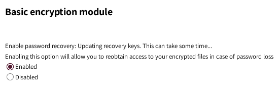

# Selbstverwaltungscenter

Als Erstes musst Du Dich mit Deinen **Disroot**-Anmeldedaten im [Selbstverwaltungscenter](https://user.disroot.org) anmelden und die Option **change password** auswählen.

## Passwort ändern

Befolge die Regeln zur Passworterstellung und gibt Dein neues Passwort zweimal ein. Je grüner der Balken neben Deinem neuen Passwort dabei wird, umso sicherer ist es. Bestätige die Änderung mit der Enter-Taste oder durch Klicke auf ***Change Password***

 
Wenn Du Dein Passwort geändert hast, solltest Du unbedingt noch Deinen Schlüssel zur Verschlüsselung in der **Cloud** ändern, da alle Deine Dateien in **Nextcloud** mit einem Schlüssel, der aus Deinem Passwort generiert wird, verschlüsselt sind. Nach der Passwortänderung passen also Schlüssel und Passwort nicht mehr zueinander.

# Nextclouds Verschlüsselungskey

1. Gehe zu **[https://cloud.disroot.org](https://cloud.disroot.org)** und melde Dich mit Deinem neuen Passwort an.
Du wirst eine gelbe Nachricht am oberen Rand der Seite sehen: 

 
    `Invalid private key for Encryption App. Please update your private key password in your personal settings to recover access to your encrypted files.`

2. Klicke auf Deinen Namen in der oberen rechten Ecke und wähle **Personal** aus dem Menü.

3. Scrolle nach unten zu **Basic Encryption Module**, gib Dein altes und Dein neues Passwort ein und klicke auf **Update Private Key Password**.

4. Melde Dich von **Nextcloud** ab und wieder an und das war's. Du hast alles erledigt und kannst wieder auf Deine Dateien zugreifen.

  **WICHTIG**
|:--:|
Wenn Du Dein Passwort verlierst oder vergisst, hast Du **keine** Möglichkeit mehr, an Deine Dateien zu kommen, da diese verschlüsselt sind. Nicht mal die Server-Administratoren können den Inhalt Deiner Dateien sehen.
