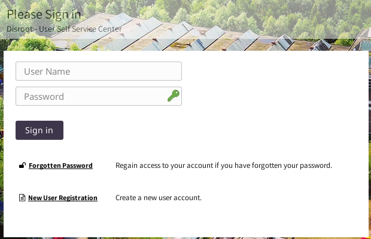
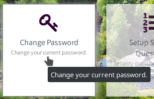

# Self Service Center

First you need to log in to the **Self Service Center** at https://user.disroot.org and choose to **change password**.

# Nextcloud's Encryption Key

Once you changed your password in the **Self Service Center** you will need to make sure to change your encryption key in **Nextcloud**, since all your files in **Nextcloud** are encrypted with a key that is generated from your password.
1. Go to **[https://cloud.disroot.org](https://cloud.disroot.org)** and log in with your new password.
You will see a yellow message on top of the page: 
`Invalid private key for Encryption App. Please update your private key password in your personal settings to recover access to your encrypted files.`
2. Click on your name in the top right corner and select **Personal** from the menu.
3. Scroll down to **Nextcloud basic encryption module** and type in your old password and your new password and click **Update Private Key Password**.
4. Log out of **Nextcloud** and log back in and that's it, you're all set and can view your file again.

!! 
!! **NOTE!** If you lose your password, you won't be able to retrieve your files on the cloud as they're encrypted, so even the server administrators can't see their content.
