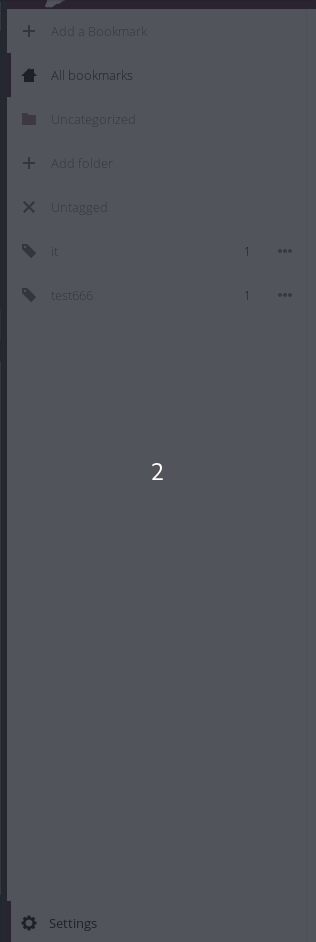

Exporting your bookmark data stored on the cloud is very easy with **Disroot**.

1. Login to the [cloud](https://cloud.disroot.org)

2. Select Bookmark app

3. Select Settings (on the bottom of the right sidebar) and press **"Export"** button

