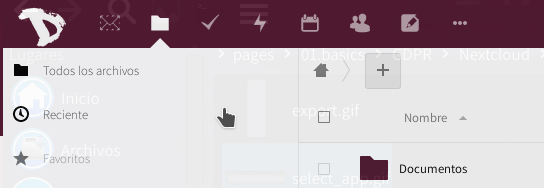

Exportar la información almacenada en la nube de tus marcadores es muy sencillo con **Disroot**.

1. Inicia sesión en la [nube](https://cloud.disroot.org)

2. Selecciona la aplicación Marcadores

3. Selecciona Configuración (abajo, en la barra lateral izquierda) y presiona el botón **"Export"**

