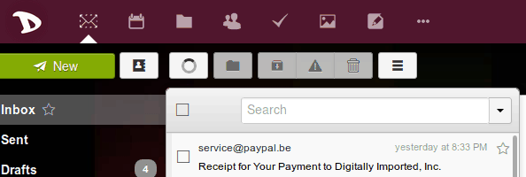
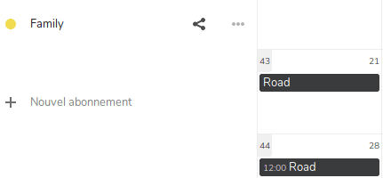

Exporter vos calendriers/agendas est très simple:

1. Connectez-vous sur [cloud](https://cloud.disroot.org)

2. Choisissez l'application Agenda

3. Exportez n'importe lequel de vos agendas / calendriers ou de ceux auquels vous êtes abonnés.
Sélectionnez le bouton de menu *"trois petits points"* à côté du calendrier que vous voulez exporter et cliquez sur  *"Télécharger"*. Le calendrier exporté est sauvé au format .ics .

Répétez cette procédure pour tous les autres calendriers / agendas que vous voulez exporter.
