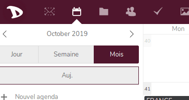
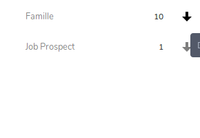

Vos Contacts peuvent être exportés à tout moment de manière très facile:

1. Connectez-vous sur votre compte Cloud [https://cloud.disroot.org](https://cloud.disroot.org)

2. Choisissez l'app "*Contacts*".

3. Choisissez le bouton de téléchargement à côté du carnet d'adresses que vous souhaitez exporter. Ils seront sauvegardés au format .vcf .

