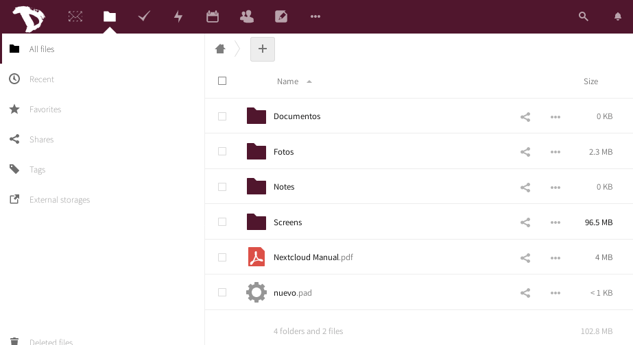

You can download your files as easy as in case of any **Nextcloud** app.

1. Login to your [cloud](https://cloud.disroot.org)

2. Select **Files** app

3. Select all files by clicking on the checkbox

4. Then click on the **Actions** menu and select *Download*

