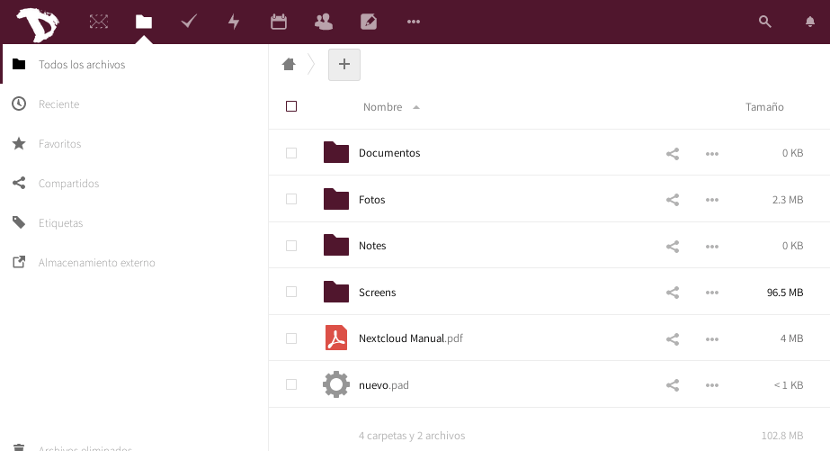

Puedes descargar tus archivos tan fácilmente como en cualquiera del resto de las aplicaciones de **Nextcloud**.

1. Inicia sesión en la [nube](https://cloud.disroot.org)

2. Selecciona la aplicación **Archivos**

3. Selecciona todos los archivos haciendo click en el cuadro de selección

4. Luego haz click en el menú **Acciones** y selecciona *Descargar*

