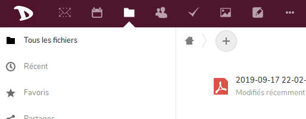
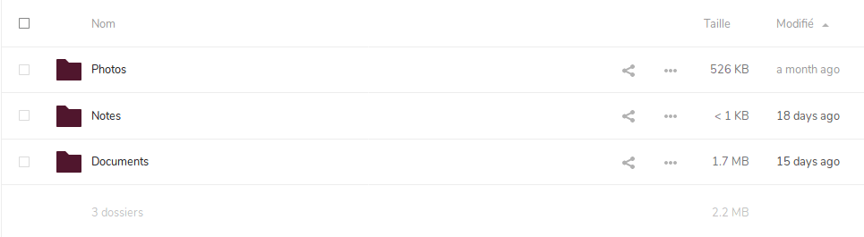

Vous pouvez télécharger vos fichiers et notes très facilement, comme pour toutes les applications **Nextcloud**.

1. Connectez-vous sur [cloud](https://cloud.disroot.org)

2. Choisissez l'application **Fichiers** 

3. Sélectionnez tous les fichiers avec la case à cocher.

4. Cliquez ensuite sur **Actions** menu et choisissez *Télécharger*

