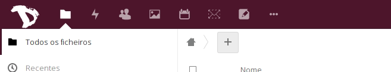
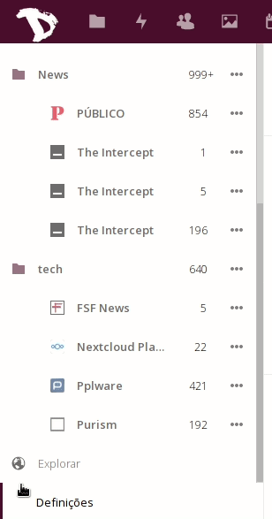

Exportar os seus feeds de notícias e as suas subscrições é muito fácil.

1. Faça login em [cloud.disroot.org](https://cloud.disroot.org)

2. Selecione a aplicação **News**

3. Carregue no botão **'Definições'** no fundo da barra lateral esquerda.

5. Dependendo das suas necessidades pode exportar os seus feeds tanto como:
  - **'Subscrições (OPML)'** - Isto é especialmente útil se quiser mudar de fornecedor de Feeds (leitor de RSS) ou se simplesmente quiser ter um backup das suas listas de sites de notícias.
  - Artigos Não Lidos/Classificados - Se quiser exportar os conteúdos das próprias notícias por exemplo para usar offline, arquivo ou migração de dados.

  **Nota:** Os artigos lidos são removidos regularmente.

