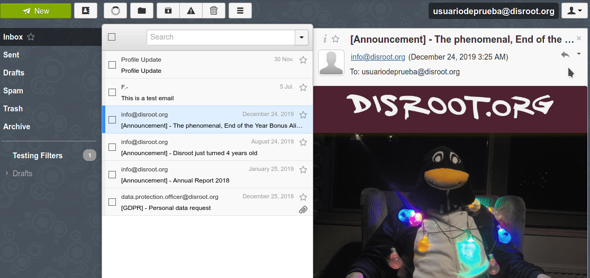

# Export your emails

To export all your emails from **Disroot Webmail** our suggestion is to use an email client, like **Thunderbird**.

## RainLoop
**RainLoop** the software we currently use, does not allow this task to be done in a practical way: emails must be exported one by one.

* Log in at **Disroot Webmail**.
* Select the mail you want to export.
* On the right, click on the reply icon.
* A list of options will open, select the last one: **Download as .eml file**.
* Finally, you will be asked what you would like to do with file, save it on your device.

!! ##### **NOTICE**: You should repeat this proccess with every single email you want to export.

----

## Exporting emails from Thunderbird

**Thunderbird** does not come with tools for exporting and importing mail natively. For this it is necessary to install an add-on.

Both the add-on installation and the process of exporting the emails is quite simple.

### Installing the ImportExportTools add-on

* Run Thunderbird
* Go to **Tools** at the Menu bar and select **Add-ons**
* In the add-ons search field type _export tools_ and then press enter
* Find **ImportExportTools NG**, a small **GPL** software that add import/export tools.
* Click on **Add to Thunderbird**
* After installing and giving the necessary permissions for the add-on, you are now ready to back up all your emails.

This add-on adds a new menu item in the **Tools** and the context menues.

### Exporting your emails
In **Thunderbird**, select a folder o directory you want to back up and right click.
The import/export tool submenu displays a number of actions which you can peform to import or export various types of information into and out of **Thunderbird**.

You can export:
  * Individual folders and/or all folder messages (EML, HTML, PDF, CSV or plaintext)
  * Export as individual files or a single file
  * Export indexes as plain text or CSV
  * Export messages from search dialog
  * Export complete profiles or just the emails files

And import:
  * Mailbox files (Mbox files including the structures)
  * Profiles
  * EML and EMLX files
  * Individual or all directory files
