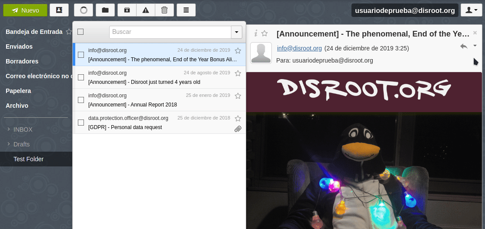

# Exportar tus correos

Para exportar tus correos desde el **Webmail de Disroot**, nuestra sugerencia es que utilices un cliente de correo, como **Thunderbird**.

## RainLoop
**RainLoop**, el software de correo electrónico que actualmente utilizamos, no permite realizar esta tarea de manera práctica: los correos deben exportarse uno por uno.

* Inicia sesión en el **Webmail de Disroot**.
* Selecciona el correo que quieras exportar.
* A la derecha del ícono de "Responder" está la lista de opciones, haz click en el ícono con forma de flecha invertida.
* Se desplegará una lista de opciones, selecciona la última: **Descargar como archivo .eml**.
* Finalmente, se te preguntará qué quieres hacer con el archivo. Seleccionar guardarlo en tu dispositivo.

!! ##### **AVISO**: Debes repetir este proceso con cada uno de los correos que quieras exportar.

----

## Exportando correos desde Thunderbird

**Thunderbird** no trae de manera nativa herramientas para exportar e importar correos electrónicos. Para esto es necesario instalar un complemento.

Tanto la instalación del complemento como el proceso de exportar los correos es bastante sencilla.

### Instalando el complemento ImportExportTools

* Inicia Thunderbird
* Ve a **Herramientas** en la barra de menú y selecciona **Complementos**
* En el campo de búsqueda de complementos, escribe `export tools` y luego presiona Enter
* Busca y selecciona **ImportExportTools NG**, un pequeño software **GPL** que agrega herramientas de importación/exportación de correos al cliente.
* Click en **Agregar a Thunderbird**
* Después de instalar y darle los permisos necesarios al complemento, puedes empezar a respaldar todos tus correos.

Este complemento agrega una nueva opción en el menú de **Herramientas** y en el menú contextual.

### Exportando tus correos
En **Thunderbird**, selecciona una carpeta o directorio que quieras respaldar y haz click derecho. El submenú de la herramienta importar/exportar muestra una cantidad de acciones que puedes realizar para importar o exportar varios tipos de información desde y hacia **Thunderbird**.

Puedes exportar:
  * carpetas individuales y/o todas las carpetas de mensajes (en EML, HTML, PDF, CSV o texto plano);
  * archivos individuales o como un solo archivo;
  * índices como texto plano o CSV;
  * mensajes desde el campo de búsqueda;
  * perfiles completos o solo los archivos de correo.

E importar:
  * archivos de buzón de correo (los archivos Mbox incluyen las estructuras);
  * perfiles;
  * archivos EML y EMLX;
  * directorios individuales o todos los directorios con archivos.
