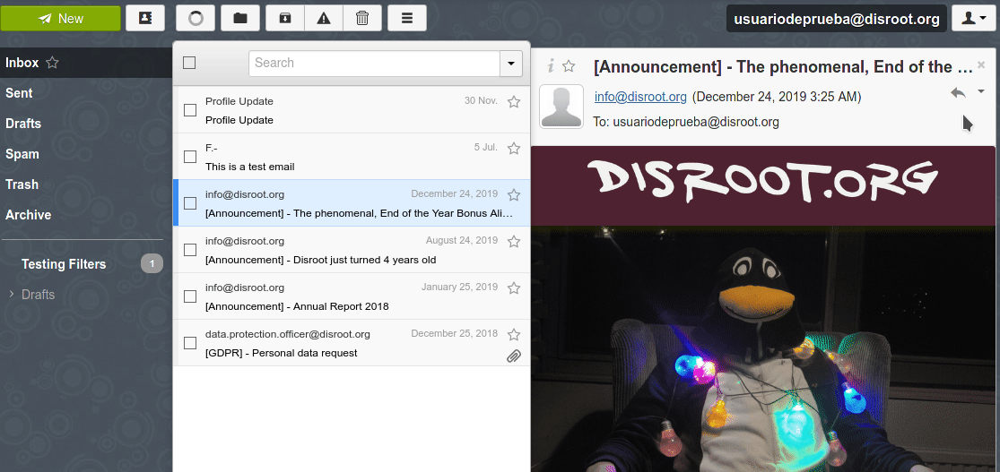

# Esporta i messaggi di posta elettronica

Per esportare tutte le tue email da **Disroot Webmail**, il nostro suggerimento è di utilizzare un client di posta elettronica, come **Thunderbird**. 

## RainLoop
**RainLoop** il software che attualmente utilizziamo, non consente di svolgere questo compito in modo pratico: le email devono però essere esportate una per una. 

* Accedi a **Disroot Webmail**.
* Seleziona il messaggio che desideri esportare.
* A destra, fai clic sull'icona della risposta.
* Si aprirà un elenco di opzioni, seleziona l'ultima: **Scarica come file .eml**.
* Infine, ti verrà chiesto cosa vuoi fare con il file, salvalo sul tuo dispositivo. 

!! ##### **ATTENZIONE**: devi ripetere questo processo con ogni singola email che desideri esportare. 

----

## Esportare i messaggi da Thunderbird

**Thunderbird** non viene fornito con strumenti per l'esportazione e l'importazione della posta in modo nativo. Per questo è necessario installare un componente aggiuntivo. 

Sia l'installazione del componente aggiuntivo che il processo di esportazione delle e-mail sono processi semplici. 

### Installare il componente aggiuntivo ImportExportTools

* Avvia Thunderbird
* Vai su **Strumenti** nella barra dei menu e seleziona **Componenti aggiuntivi**
* Nel campo di ricerca dei componenti aggiuntivi digita _export tools_ e poi premi invio
* Trova **ImportExportTools NG**, un piccolo software **GPL** che aggiunge strumenti di importazione/esportazione.
* Fai clic su **Aggiungi a Thunderbird**
* Dopo aver installato e fornito le autorizzazioni necessarie per il componente aggiuntivo, ora sei pronto per eseguire il backup di tutte le tue e-mail. 

Questo componente aggiuntivo aggiunge una nuova voce di menu negli **Strumenti** e nei menu contestuali. 

### Esporta i tuoi messaggi
In **Thunderbird**, seleziona una cartella o una directory di cui desideri eseguire il backup e fai clic con il pulsante destro del mouse.
Il sottomenu dello strumento di importazione/esportazione mostra una serie di azioni che puoi eseguire per importare o esportare vari tipi di informazioni dentro e fuori **Thunderbird**. 

Puoi esportare:
* Cartelle singole e/o tutti i messaggi delle cartelle (EML, HTML, PDF, CSV o testo normale)
* Esporta come singoli file o un singolo file
* Esporta indici come testo normale o CSV
* Esporta messaggi dalla finestra di dialogo di ricerca
* Esporta profili completi o solo i file di posta elettronica 
E importare:
* File delle caselle di posta (file Mbox comprese le strutture)
* Profili
* File EML ed EMLX
* Singoli o tutti i file di directory 
