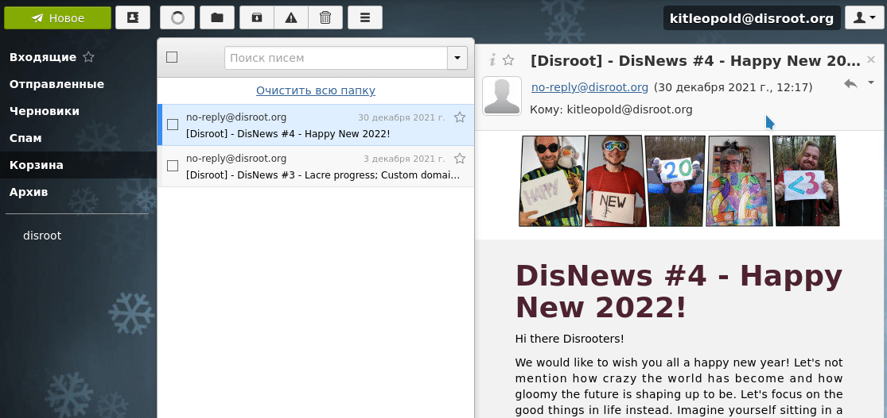

# Экспортируйте свои электронные письма

Чтобы экспортировать электронные письма из **Disroot Webmail**, мы рекомендуем использовать почтовый клиент, например **Thunderbird**.

## RainLoop
Программное обеспечение **RainLoop**, которое мы используем в настоящее время, не позволяет выполнить эту задачу на практике: электронные письма необходимо экспортировать одно за другим.

* Войдите в **Disroot Webmail**.
* Выберите письмо, которое хотите экспортировать.
* Справа от значка "Ответить" находится список вариантов, нажмите на значок стрелки вниз.
* Откроется список вариантов, выберите последний: **Скачать как .eml файл**.
* Наконец, вас спросят, что вы хотите сделать с файлом. Выберите сохранить его на своем устройстве.

!! ##### **ВНИМАНИЕ**: Вы должны повторить этот процесс с каждым электронным письмом, которое хотите экспортировать.

----

## Экспорт писем из Thunderbird

**Thunderbird** изначально не поставляется с инструментами для экспорта и импорта электронной почты. Для этого нужно установить дополнение.

Как установка дополнения, так и процесс экспорта писем довольно просты.

### Установка дополнения ImportExportTools

* Запустите Thunderbird
* Перейдите в **Инструменты** в строке меню и выберите **Дополнения и темы**.
* Перейдите на вкладку **Расширения** в левой части экрана. В строке поиска дополнений введите _export tools_ и нажмите Enter.
* Найдите и выберите **ImportExportTools NG**, небольшую программу с лицензией **GPL**, которая добавляет инструменты для импорта/экспорта почты.
* Нажмите **Добавить в Thunderbird**.
* После установки и предоставления необходимых разрешений для дополнения вы можете начать резервное копирование всех ваших писем.

Это дополнение добавляет новый пункт меню в **Инструменты** и контекстное меню.

### Экспорт ваших писем
В **Thunderbird** выберите папку или каталог для резервного копирования и нажмите правой кнопкой мыши. В подменю инструмента импорта/экспорта отображается ряд действий, которые вы можете выполнить для импорта или экспорта различных типов информации в **Thunderbird** и обратно.

Вы можете экспортировать:
  * Отдельные папки и/или все сообщения папок (EML, HTML, PDF, CSV или простой текст)
  * Отдельные файлы или в виде одного файла
  * Индексы в виде простого текста или CSV
  * Сообщения из диалога поиска
  * Весь профиль или только файлы электронной почты

И импортировать:
  * Файлы почтовых ящиков (файлы Mbox, включая структуры)
  * Профили
  * Файлы EML и EMLX
  * Отдельные или все файлы каталога
