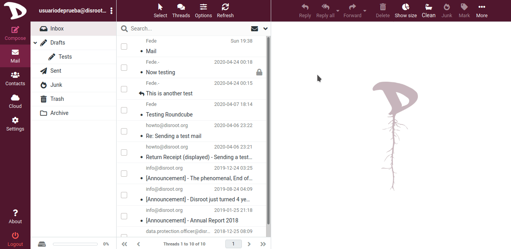

# Export your emails

Exporting your emails from **Disroot Webmail** is pretty easy.

**Roundcube** saves the messages as singles **eml** files. **EML** is an email file format which is supported by most modern email clients.

First, go to the folder where the emails you want to export/save are. You can download one, several messages or the whole folder.

- Select the messages through the **Select** action
- In the preview pane at the top bar, select **More** and then **Download**
- Choose the format in which you prefer to download the data (individual messages can be downloaded in .eml format and folders or sets of messages can be downloaded in .zip format)
- Choose where to save the file.

