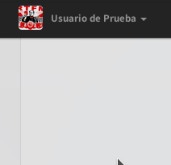
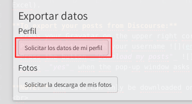
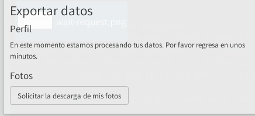
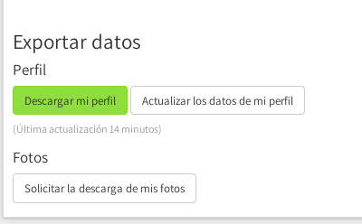

Obtener la información que proporcionaste a **Diaspora*** es completamente automatizado y puede hacerse en cualquier momento. Todo lo que necesitas hacer es:

1. Iniciar sesión en Diaspora* en [https://pod.disroot.org](https://pod.disroot.org)

2. Ve a las configuraciones de la cuenta:

3. Una vez que estés en la página de las configuraciones, desplázate hacia el final y selecciona qué información quieres solicitar. Puedes obtener todas tus publicaciones o imágenes que hayas subido.

Luego de haber clickeado cualquiera de las botones de solicitud, necesitarás esperar unos momentos (dependiendo del tamaño de tu cuenta) hasta que el requerimiento haya sido procesado y estarás listo para descargar tus datos.

4. Una vez que la información esté lista para descargar, puedes hacerlo clickeando el botón "Descargar" en el final de la página de configuraciones.

