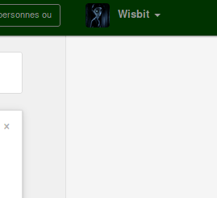
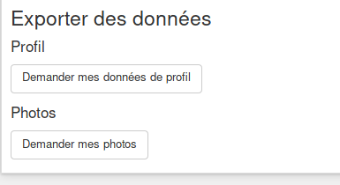
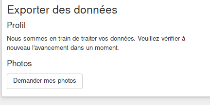
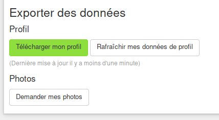

Obtenir vos données de profil fournies à **Diaspora** est entièrement automatisé et peut être fait n'importe quand. Tout ce que vous ayez à faire est :

1. Connectez-vous à diaspora [https://pod.disroot.org](https://pod.disroot.org)

2. Aller dans vos paramètres de compte:

3. Une fois dans les paramètres, allez tout en bas et choisissez quelles données vous voulez récupérer, les données de profil, ou les photos que vous avez uploadées.

Une fois que l'un de ces boutons a été cliqué, vous devez attendre quelques instants pour que la requête soit traitée (le temps dépend de la taille de votre compte.

4. Une fois les données prêtes au téléchargement, vous pouvez les obtenir en cliquant sur le lien.

