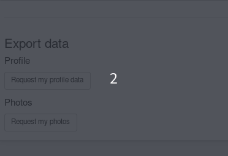
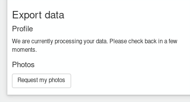

L'ottenimento dei dati forniti a ** Diaspora *** è completamente automatizzato e può essere effettuato in qualsiasi momento. Tutto quello che devi fare è:

1. Accedere a **Diaspora*** al seguente indirizzo [https://pod.disroot.org](https://pod.disroot.org).

2. Andare nelle impostazioni dell'account.

3. Entrato nella pagina delle impostazioni, scorri fino in fondo e scegli quali dati desideri richiedere. Puoi scaricare tutti i tuoi post o le immagini che hai caricato.

Una volta premuto uno qualsiasi dei pulsanti di richiesta, dovrai attendere alcuni istanti (a seconda delle dimensioni del tuo account) fino a quando la richiesta non viene elaborata e sarai quindi pronto per scaricare i tuoi dati.

4. Quando i dati saranno pronti per essere scaricati, li potrai ottenere facendo clic sul pulsante "Download" nella parte inferiore delle impostazioni.

