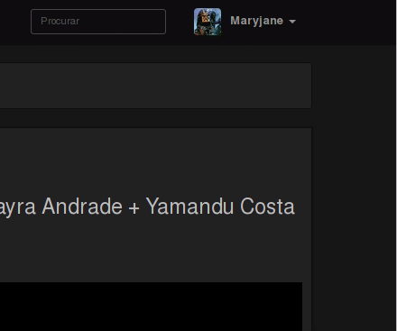
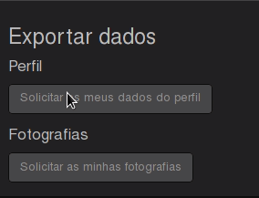
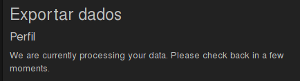
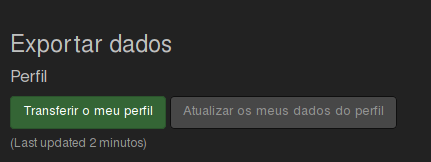

Obter os dados que forneceu ao Diaspora é um processo completamente automático que pode ser pedido a qualquer altura. Tudo o que tem que fazer é:

1. Fazer login no diaspora em [https://pod.disroot.org](https://pod.disroot.org)

2. Ir a 'Definições':
 

3. Uma vez na página de definições, vá até ao fundo da página e escolha os dados que quer exportar. Você pode pedir todos os seus posts ou as imagens que carregou para o Diaspora.

Assim que carregar em qualquer um dos botões de solicitação terá que esperar alguns momentos (dependendo do tamanho da sua conta) até o pedido ser processado e estar pronto para descarregar os seus dados

4. Assim que os seus dados estiverem prontos para serem descarregados, você pode proceder à descarga dos mesmos carregando no botão de transferência no fundo da págian de definições.

