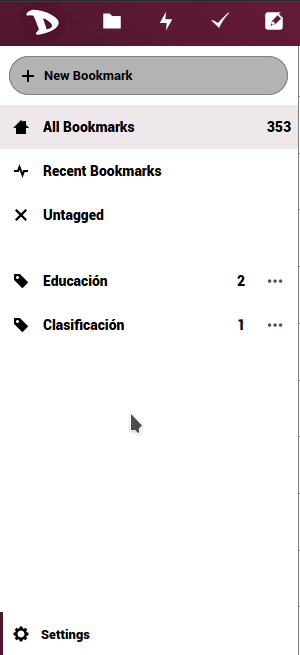

Exportar los datos de tus marcadores almacenados en la nube de **Disroot** es muy sencillo.

  - Inicia sesión en la [nube](https://cloud.disroot.org).
  - Selecciona la aplicación **Marcadores**.

  

  - Selecciona **Configuraciones** (on the bottom of the right sidebar) y presiona el botón **Exportar**.

  

  - Elige dónde guardar el archivo.
