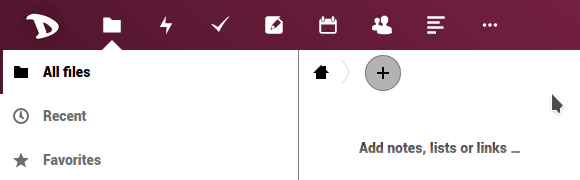
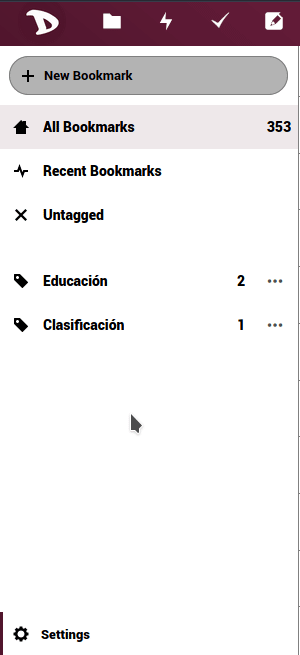

L'exportation de vos données de signets stockées sur le nuage **Disroot** est très simple.

  - Connectez-vous au [nuage] (https://cloud.disroot.org).
  - Sélectionnez l'application **Signet**.

  

  - Sélectionnez **Paramètres** (en bas de la barre latérale gauche) et appuyez sur le bouton **Export**.

  

  - Sélectionnez l'endroit où enregistrer le fichier.
