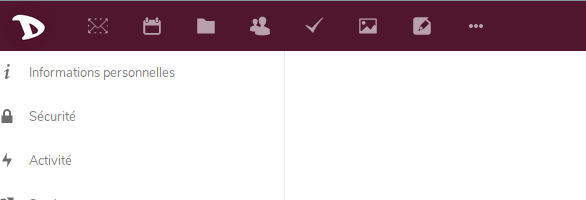
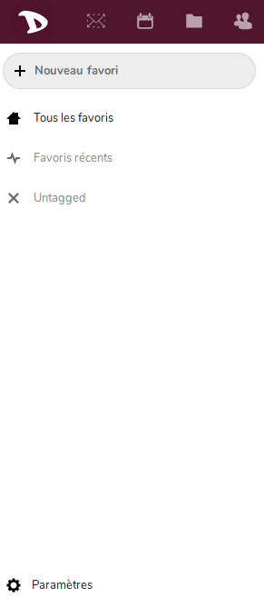

Exporter les données de vos favoris stockées sur le cloud est très facile avec **Disroot**.

1. Connextez-vous sur [cloud](https://cloud.disroot.org)

2. Choisissez l'application "Favoris"

3. Choisissez Paramètres (au bas de la barre latérale gauche et cliquez sur le bouton **"Exporter"**

