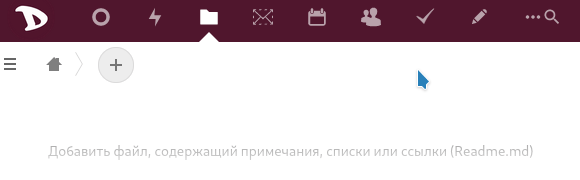
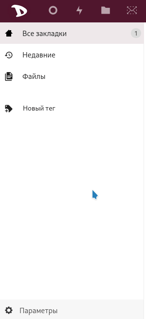

Экспорт ваших закладок, хранящихся в облаке **Disroot**, очень прост.

  - Войдите в [облако](https://cloud.disroot.org).
  - Выберите приложение **Закладки**.

  

  - Выберите **Параметры** (в нижней части левой боковой панели) и нажмите кнопку **Экспортировать**.

  

  - Выберите, где сохранить файл.
