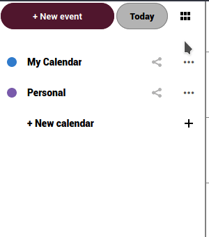

Exporting calendars is quite simple:

  - Login to the [cloud](https://cloud.disroot.org)
  - Select Calendar app

  

  - To export any of your calendars or the calendars you are subscribed to, select the *"three dot"* menu option next to the calendar and hit *"Export"* option. Exported calendar is saved in .ics format.

  

  - Repeat the process for all other calendars you want to export.
