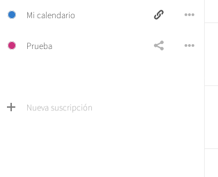

Exportar calendarios es bastante simple:

  - Inicia sesión en la [nube](https://cloud.disroot.org)
  - Selecciona la aplicación Calendario

  

  - Para exportar cualquiera de los calendarios que tengas, haz click en el menú de *"tres puntos"* que estará al lado del que quieras respaldar y selecciona la opción *"Descargar"*. El calendario exportado se guarda como un archivo .ics.

  

  - Repite el procedimiento para exportar cualquier calendario.
